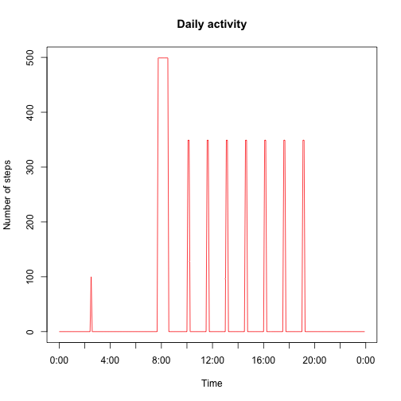
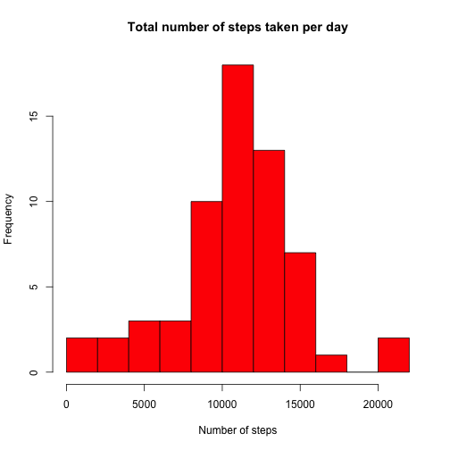
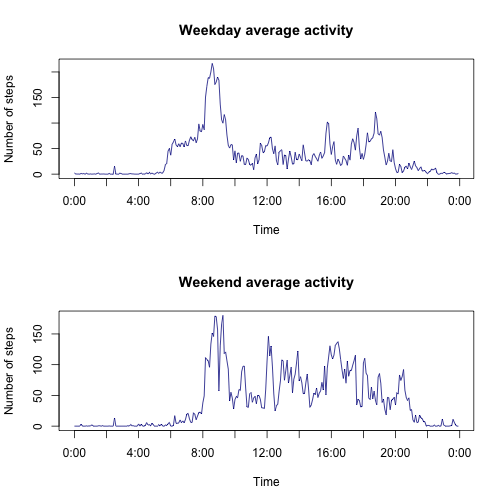

# Reproducible Research: Peer Assessment 1
The data used here can be obtained from Roger D. Peng's repository, created for the Reproducible Research course, via this link https://github.com/rdpeng/RepData_PeerAssessment1/blob/master/activity.zip
This is the data from a personal monitoring device for two months. The dataset includes three columns: number of steps, date and interval identifier. For each day there are 288 rows.

```
##     steps       date interval
## 688    51 2012-10-03      915
## 689   516 2012-10-03      920
## 690   245 2012-10-03      925
```

## Loading and preprocessing the data

Assuming it is now downloaded and in the working directory, unzip

```r
unzip("activity.zip")
```
and read into R

```r
activity <- read.csv("activity.csv")
```

Next, check if there is missing data

```r
sum(is.na(activity[, "steps"]))
```

```
## [1] 2304
```
And there is, so it is needed to subset the data excluding the NAs. But first check if there are whole days for which the data is missing, or there are NAs somewhere in the middle (that can potentially void the data of the whole day, so it'd be preferable not to have such thing). The idea is simple — create a vector of logical TRUEs and FALSEs and see the number of consecutive appearances of TRUEs (which represent NAs). if the number is a multiple of 288, then NAs always come in sequences of 1 day.

```r
actna <- is.na(activity[, "steps"])
# next function will give lengths of consequent TRUEs and FALSEs
lengths <- rle(actna)[[1]]
# But only TRUEs are of interest, so only odd elements are printed and also
# divided by 288 for easier examination
lengths[seq(1, length(lengths), 2)]/288
## [1] 1 1 1 1 2 1 1
```
Yes, only 8 days are missing as whole. Now it is safe to subet the data (also losing the unused factors)

```r
act <- droplevels(activity[complete.cases(activity), ])
```

## Mean total number of steps taken per day

Create a vector with sums of steps for each day

```r
tot_st <- as.vector(tapply(act$steps, act$date, sum))
```
Simply take mean and median of it and plot histogram

```r
mean(tot_st)
median(tot_st)
```

```
## [1] "Mean total number of steps is 10766"
```

```
## [1] "Median total number of steps is 10765"
```

```r
hist(tot_st, main = "Total number of steps taken per day", xlab = "Number of steps", 
    col = "red", breaks = 10)
```

 

## Average daily activity pattern

Average the number of steps for each 5 minute interval across all days

```r
aver_act <- as.vector(tapply(act$steps, act$interval, mean))
```
Time series graph

```r
plot(aver_act, type = "l", main = "Average number of steps during the day", 
    xlab = "Time", ylab = "Number of steps", xlim = c(1, 289), xaxt = "n", col = "red")
labels <- c()
for (i in 0:12) {
    labels <- c(labels, paste(2 * (i%%12), ":00", sep = ""))
}
axis(1, at = seq(1, 289, 24), labels = labels)
```

 

Interval with maximum number of steps, averaged across all days

```r
int <- act[which.max(aver_act), 3]
intnext <- act[which.max(aver_act) + 1, 3]
paste(substr(int, 1, nchar(int) - 2), ":", substr(int, nchar(int) - 1, nchar(int)), 
    "-", substr(intnext, 1, nchar(intnext) - 2), ":", substr(intnext, nchar(intnext) - 
        1, nchar(intnext)), sep = "")
```

```
## [1] "8:35-8:40"
```

## Imputing missing values

As was found in the beginning of this document, NAs come in batches of 288, i.e. one whole day, so the missing data can only be filled using measurements from other days. It'd be better to use the method with the largest amount of data available, but activity may differ from day to day, so there is a need to inspect the avaiable data. 

Add two columns which hold days of the week.

```r
actl <- act
actl$day <- weekdays(as.Date(act[, "date"], "%Y-%m-%d"))
```
Then find the days that are missing

```r
actna <- activity[!complete.cases(activity), ]
actna$day <- weekdays(as.Date(actna[, "date"], "%Y-%m-%d"))
tapply(actna$day, actna$date, unique)[!is.na(tapply(actna$day, actna$date, unique))]
```

```
##  2012-10-01  2012-10-08  2012-11-01  2012-11-04  2012-11-09  2012-11-10 
##    "Monday"    "Monday"  "Thursday"    "Sunday"    "Friday"  "Saturday" 
##  2012-11-14  2012-11-30 
## "Wednesday"    "Friday"
```
Monday and Friday are missed twice, Tuesday is never missed, all others are missed once only.

There are 53 available days of data, so each day of the week is repeated 7-9 times. If the activity of each weekday is about the same every time, then it's reasonbale to imput the missing data by using the mean values.

Code below creates a list of vectors with average activity for each day of the week (including unnecessary Tuesday, but that makes the code more convenient to use later, since days can now be represented as numbers 1-7). Also outputs the number of times data for each day was collected.

```r
days <- c("Monday", "Tuesday", "Wednesday", "Thursday", "Friday", "Saturday", 
    "Sunday")
aver_actl <- list()
nmb <- c()
for (i in 1:length(days)) {
    aver_actl[[i]] <- as.vector(tapply(actl[actl$day == days[i], ]$steps, actl[actl$day == 
        days[i], ]$interval, mean))
    nmb[i] <- length(grep(days[i], actl$day))/288
}
nmb
```

```
## [1] 7 9 8 8 7 7 7
```

Tuesday is the only day for which the data is collected 9 times, but its data is not missing, so Wednesday will be used in the first part of the analysis. Plotting the mean activity and activity for each occurance of Wednesday, an interesting observation can be made.

```r
act_wed <- actl[actl$day == days[3], ]
# empty plot
plot(0, 0, ylim = c(0, 800), xlim = c(0, 288), type = "n", xaxt = "n", xlab = "Time", 
    ylab = "Number of steps", main = "Daily activity")
axis(1, at = seq(1, 289, 24), labels = labels)
col1 = "aquamarine3"
col2 = "chocolate"
col3 = "red"
lines(act_wed[(0 * 288 + 1):(1 * 288 + 288), 1], type = "l", col = col1)
lines(act_wed[(1 * 288 + 1):(2 * 288 + 288), 1], type = "l", col = col2)
lines(act_wed[(2 * 288 + 1):(3 * 288 + 288), 1], type = "l", col = col1)
lines(act_wed[(3 * 288 + 1):(4 * 288 + 288), 1], type = "l", col = col2)
lines(act_wed[(4 * 288 + 1):(5 * 288 + 288), 1], type = "l", col = col1)
lines(act_wed[(5 * 288 + 1):(6 * 288 + 288), 1], type = "l", col = col1)
lines(act_wed[(6 * 288 + 1):(7 * 288 + 288), 1], type = "l", col = col1)
lines(act_wed[(7 * 288 + 1):(7 * 288 + 288), 1], type = "l", col = col1)
lines(aver_actl[[3]], type = "l", col = col3)
lines(aver_actl[[3]], type = "l", col = col3)  #to make it fat and stick out
legend("topright", legend = c("wed type 1", "wed type 2", "mean"), lty = c(1, 
    1, 1), col = c(col1, col2, col3))
```

 

From the above plot it can be seen that the mean number of steps is much smaller than the actual data for any of the days. So simply changing NAs with mean values, while retains the mean total number of steps, does not represent the actual daily activity at all. The same happens for any other day, if plotted.

In 6 of those Wednesdays, there is a lot of activity during the morning hours (~50 minutes/day from 6 to 10 AM), then several spikes (5-10 minutes) going up about 65% the height of the morning activity. Then a bit longer activity near the everning. The rest of the day it is essentially 0. The two remaining days are about the same, except for the absence of high activity in the morning (the guy probably took a taxi).

The strategy to fill the missing data is going to be the following:
- calculate mean number of total steps for a certain day of the week
- pick a random starting point from 6 to 9 AM
- input 50% of total number of step (in a day) into 10 consequent intervals, evenly distributed
- from the end of that interval, locate 7 equally spaced (1.5 hours) intervals of 10 minutes and fill each with 7% of total number of steps, equally distributed.
- place the remaining 1% in the middle of the night to emulate sleepwalking, just for fun
- fill the rest of NAs with zeros
- optionally, some noise can be added near activity peaks

Note that due to the second step of this strategy, total replication of the produced results is not possible.


```r
# Prepare data frame
activity$day <- weekdays(as.Date(activity[, "date"], "%Y-%m-%d"))
activity$week <- "Weekday"
activity[activity$day == "Saturday", ][, "week"] <- "Weekend"
activity[activity$day == "Sunday", ][, "week"] <- "Weekend"
activity$week <- as.factor(activity$week)
activity$day <- as.factor(activity$day)
# Everything is done for each day, so a for loop is started.
#'days' vector is changed to represent the 8 missed days
days[2] <- days[1]
days[8] <- days[5]
for (i in 1:length(days)) {
    daytotal <- as.numeric(tapply(activity[activity$day == days[i], ]$steps, 
        activity[activity$day == days[i], ]$date, sum))
    meanday <- mean(daytotal, na.rm = TRUE)
    mornstart <- as.numeric(sample(72:118, 1))
    mornend <- mornstart + 10
    # find the beginning of a day with NAs
    nastart <- as.numeric(which(is.na(activity))[1])
    # fill the the day with 0
    activity[nastart:(nastart + 287), 1] <- 0
    # input morning activity
    activity[(nastart + mornstart):(nastart + mornstart + 9), "steps"] <- round(meanday * 
        0.05)
    # daily peaks
    for (i in 1:7) {
        activity[(nastart + mornend + i * 18):(nastart + mornend + i * 18 + 
            1), "steps"] <- round(meanday * 0.035)
    }
    # nightly toilet runs
    activity[(nastart + 30), "steps"] <- round(meanday * 0.01)
}
```

Example of the resulting activity during one day

```r
plot(activity[1:288, 1], type = "l", col = "red", xaxt = "n", xlab = "Time", 
    ylab = "Number of steps", main = "Daily activity")
axis(1, at = seq(1, 289, 24), labels = labels)
```

 

Using the code from parts 1 and 2 (substituting the relevant data frame name) histogram of total number of steps can be plotted and mean/median values are found.

```
## [1] "Mean total number of steps is 10821"
```

```
## [1] "Median total number of steps is 11015"
```

 

Since the imputting was made using mean number of steps for each separate day of the week, mean and median values of the whole data frame have changed. Mean has changed only slightly, but the median has changed quite a bit: this is due to the imputting strategy and the definition of median value. The shape of steps taken in a given interval with activity is a step function instead of beeing a gaussian bell as it is during the days with available data, creating a lot of elements with the same value.


## Differences in activity patterns between weekdays and weekends

The following graph compares the average activity during weekends and weekdays.
 

Code for plotting the above graph

```r
weact <- tapply(activity[activity$week == "Weekend", ]$steps, activity[activity$week == 
    "Weekend", ]$interval, mean)
wdact <- tapply(activity[activity$week == "Weekday", ]$steps, activity[activity$week == 
    "Weekday", ]$interval, mean)
par(mfrow = c(2, 1))
plot(wdact, type = "l", col = "darkblue", main = "Weekday average activity", 
    xlab = "Time", ylab = "Number of steps", xaxt = "n")
axis(1, at = seq(1, 289, 24), labels = labels)
plot(weact, type = "l", col = "darkblue", main = "Weekend average activity", 
    xlab = "Time", ylab = "Number of steps", xaxt = "n")
axis(1, at = seq(1, 289, 24), labels = labels)
```
